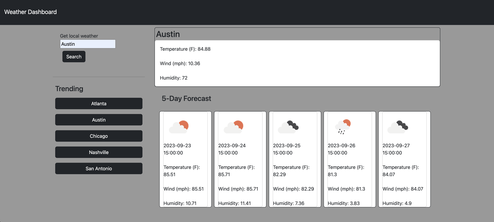

# WeatherDash

## Description

The "Weather Finder" is a user-friendly web application designed to provide current and five-day weather forecasts for cities around the globe.

## Objective

- **Why was this project built?**  
   To assist users in planning their days by providing real-time and forecasted weather conditions.

- **What problem does it solve?**  
   To provide a visually intuitive way of weather forecasting. It provides users with a clear and concise view of the weather for their chosen city, making it easier for them to plan activities accordingly.

- **What did you learn?**  
   To exercise working with third party API's. Throughout the creation of this project, I've become more proficient in working with APIs, especially the OpenWeatherMap API, and dynamically updating the DOM using vanilla JavaScript.

## Table of Contents

- [Installation](#installation)
- [Usage](#usage)
- [Credits](#credits)
- [License](#license)

## Installation

No installation is necessary; simply follow the provided link.

[WeatherDash](https://andrewtullos.github.io/WeatherDash/)

To use this as a starter source code:

1. Clone the repository to your local machine.
2. Open the index.html in your preferred browser.
3. Ensure you have an active internet connection for API calls.

## Usage

1. Enter the name of the city in the search bar.
2. Click on the "Search" button.
3. View the current weather conditions and the five-day forecast displayed on the page.

## Credits

- [Andrew Tullos](https://github.com/AndrewTullos)

## Resources

- OpenWeatherMap API: [OpenWeatherMap](https://openweathermap.org/)

### Helpful Links:

[API Study Material](https://coding-boot-camp.github.io/full-stack/apis/how-to-use-api-keys)

## License

This project is licensed under the MIT License. For more details, refer to [https://choosealicense.com/](https://choosealicense.com/).

---

## Badges

## Features

- Real-time weather conditions including temperature, wind speed, and humidity.
- Five-day forecast with daily weather summaries.
- Dynamic UI that's easy to navigate.
